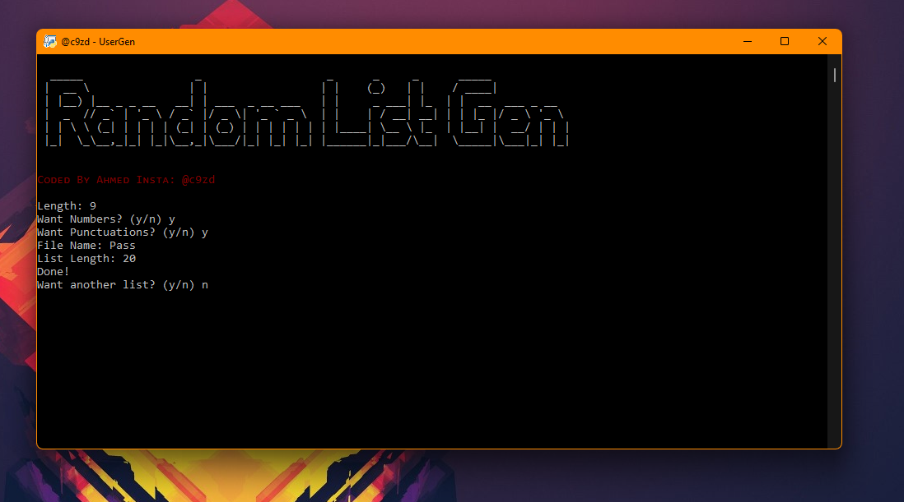
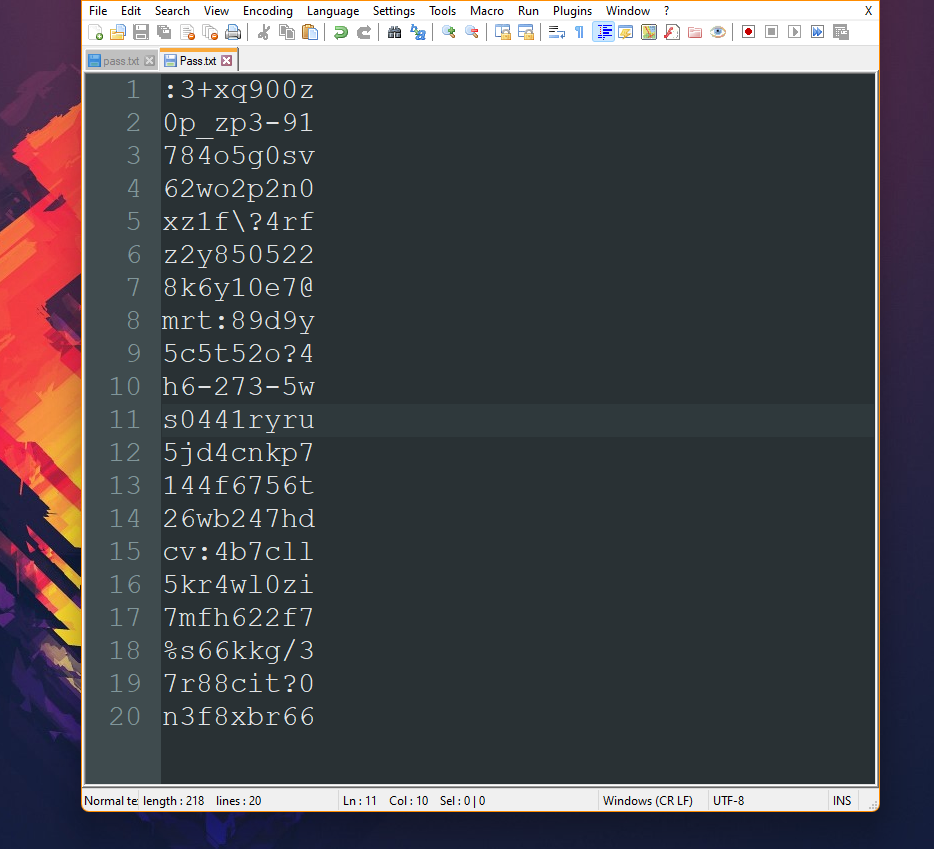

# Random List Generator
Create Random anything! from passwords to usernames, you can randomize anything :)

> this is a pretty advanced yet super simple cmd-type python script, takes inputs from the user and creates the desired output. 

# Preview 

